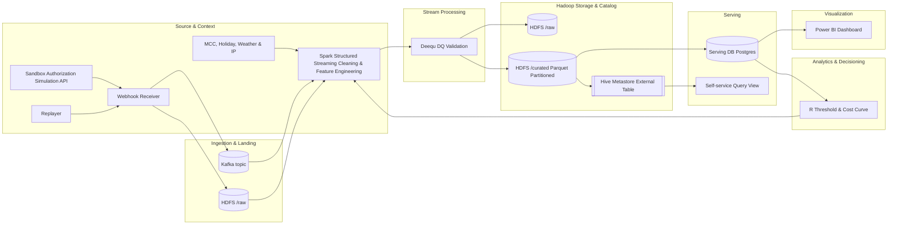

```mermaid
flowchart LR
subgraph Source["Source & Context"]
A1[Sandbox Authorization Simulation API] --> A3
A2[Replayer] --> A3
A4[MCC, Holiday, Weather & IP] --> C1
end

subgraph Ingest["Ingestion & Landing"]
    A3[Webhook Receiver] --> B1[(Kafka topic)]
    A3 --> B2[(HDFS /raw)]
end

subgraph Stream["Stream Processing"]
    B1 --> C1[Spark Structured Streaming Cleaning & Feature Engineering]
    B2 --> C1
    C1 --> C2[Deequ DQ Validation]
end

subgraph HadoopStore["Hadoop Storage & Catalog"]
    C2 --> D1[(HDFS /raw)]
    C2 --> D2[(HDFS /curated Parquet Partitioned)]
    D2 --> D3[[Hive Metastore External Table]]
end

subgraph Serving["Serving"]
    D2 --> E1[(Serving DB Postgres)]
    D3 --> E2[Self-service Query View]
end

subgraph Analytics["Analytics & Decisioning"]
    E1 --> F1[R Threshold & Cost Curve]
    F1 --> C1
end

subgraph BI["Visualization"]
    E1 --> G1[Power BI Dashboard]
end
```